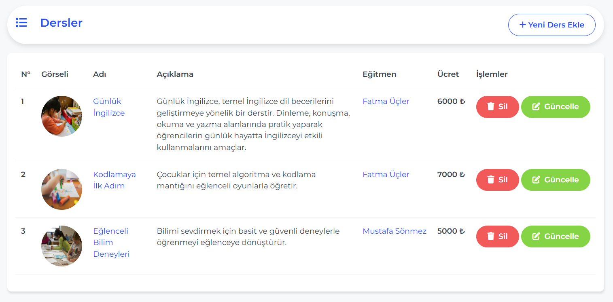

# BabyCare MongoDb Project

#### This project is a full stack project built using ASP.NET CORE MVC 

### BabyCare's Logic
BabyCareProject is a full-featured web application designed as a landing page and administration system for a children's learning or daycare platform. It combines a beautifully designed front-end with a functional back-end to manage educational content, events, testimonials, and more.

It’s ideal for platforms that cater to early childhood education, offering both visitors and administrators tailored interfaces.

### Project's Structure
The project is built using service-oriented architecture. This approach allowed us to only call the required service and strictly follow the Single Responsibility Principle, improving maintainability and readability across the application. The project implementes Unit of Work as well .So i can say that we have mainly two(2) layers:
- **Services**
- **WebUI**

#### 🛠️ Technologies Used:
- **FluentValidation.AspNetCore**
- **🔄AutoMapper**
- **Bootstrap 5**
- **FontAwesome**
- **HTML/CSS/JS - C#**

#### DataBase : MongoDB

#### Some Key features:
- **Sending Real Email**
- **Making a subscription**

##### Here is quiet view that show how its looks like

-**Managment Side**
### Dashboard

### About

### Courses

### Teachers

### Events

### Services

### Messages

### Subscribers

### Testimonials

### Galleries

### Contact

- **Landing Page**
### Banner

### About

### Testimonial

### Footer

